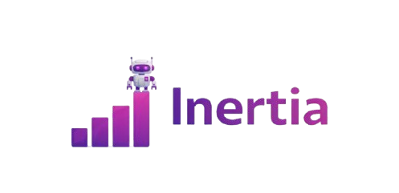

<div align="center">
  

  # 🚀 Inertia AI Destekli Gerçek Zamanlı Proje & Yetenek Yönetimi

  *Geleneksel proje yönetimini yapay zeka ve gerçek zamanlı hız ile yeniden tanımlayan, modern iş alanları için tasarlandı.*

  
  
  
  
  
</div>

---

## 🌌 Proje Vizyonu

Modern ekiplerin ihtiyaçlarına yönelik olarak geliştirilen bu portal, sadece görev atamakla kalmaz; **Yapay Zeka (AI) içgörüleri** ile ekibin potansiyelini analiz eder, yetenek matrisleri oluşturur ve **Laravel Reverb** destekli WebSocket altyapısıyla sayfayı yenilemeden anlık bir deneyim sunar. Karanlık teması (Dark Mode) ve modern kullanıcı arayüzü ile performans odaklı bir çalışma alanı sağlar.

## ✨ Öne Çıkan Özellikler

*   🤖 **AI Insights:** Proje gidişatını analiz eden ve darboğazları tahmin eden akıllı asistan.
*   🧬 **Dinamik Yetenek Matrisi:** Doğru projeye doğru yeteneği atamayı sağlayan görselleştirilmiş `Talent Matrix` sistemi.
*   ⚡ **Gerçek Zamanlı Akış:** Laravel Reverb sayesinde görev (`Card`), Sprint ve Pano (`Board`) güncellemelerinde anında ekran senkronizasyonu.
*   🏢 **İzole Çalışma Alanları:** Her ekibin veya projenin kendine ait bağımsız `Workspace` panoları.
*   🏆 **Oyunlaştırma:** Çalışan motivasyonunu artırmak için başarımlara dayalı `Badge` (Rozet) sistemi.
*   🔒 **Güvenli Kimlik Doğrulama:** Laravel Sanctum ile korunan güvenli oturum yönetimi ve şifre sıfırlama akışları.

## 🛠️ Mimari & Teknoloji Yığını

### Frontend
*   **Kütüphane:** React 18
*   **Bağlantı Katmanı:** Inertia.js
*   **Stil:** Tailwind CSS
*   **Derleyici:** Vite

### Backend
*   **Framework:** Laravel 11
*   **Veritabanı:** MySQL / PostgreSQL
*   **WebSocket:** Laravel Reverb

---

## 🚀 Kurulum

```bash
# 1. Depoyu klonla
git clone [https://github.com/ayberkaarda/inertia.git](https://github.com/ayberkaarda/inertia.git)
cd inertia

# 2. Bağımlılıkları yükle
composer install
npm install

# 3. Çevresel ayarları yap
cp .env.example .env
php artisan key:generate

# 4. Veritabanını hazırla
php artisan migrate --seed
php artisan storage:link

# 5. Sunucuları başlat (3 ayrı terminalde)
php artisan serve
npm run dev
php artisan reverb:start
